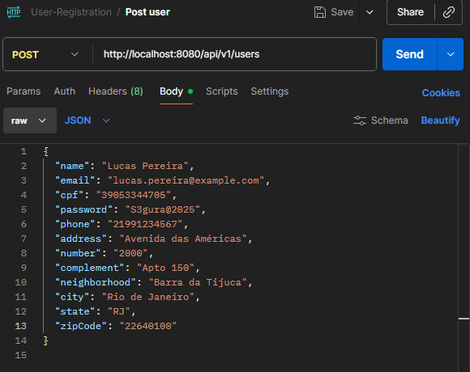
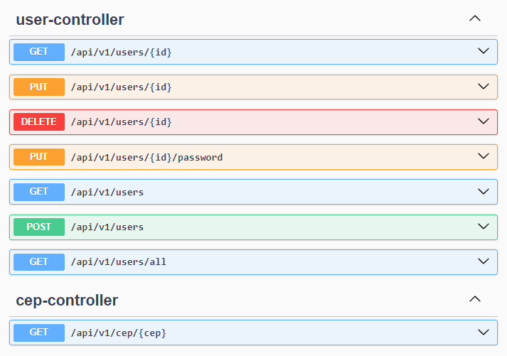
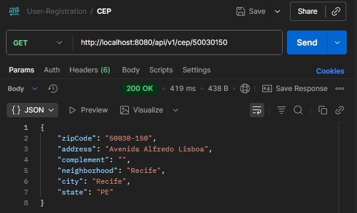
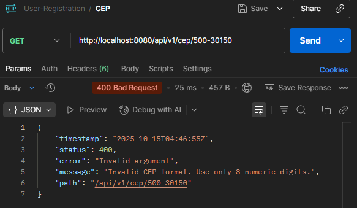

# User Registration Application
## Descrição do Projeto
Aplicação de cadastro de usuários desenvolvida com o ecossistema Spring (Spring Boot, Spring Data JPA, Spring Security), integrando consulta de CEP via [ViaCEP](https://viacep.com.br) e validando campos críticos (CPF, email, senha).
Permite criar, consultar, listar, atualizar dados de usuários e consultar endereço por CEP de forma automatizada.


Legenda: Cadastro pelo endpoint de criação de usuário.

## Arquitetura & Organização
O projeto segue arquitetura em camadas, dividindo responsabilidades de forma clara e modular:
``` 
src/main/java/com/diegobrsantosdev/user_registration_application
│
├─ config/         # Configurações do projeto (segurança, Swagger, etc)
├─ controllers/    # Endpoints REST (Usuário, CEP)
├─ dtos/           # Data Transfer Objects para requisição/resposta
├─ exceptions/     # Exceções e tratamento global
├─ mappers/        # Conversão entre entidades e DTOs
├─ models/         # Entidades JPA
├─ repositories/   # Interfaces Spring Data JPA
├─ services/       # Regras de negócio
├─ validators/     # Validações customizadas (CPF, senha, etc)
├─ viaCep/         # Integração com API ViaCep
│
└─ UserRegistrationApplication.java
```
## Tecnologias e Ferramentas Utilizadas
- **Java 24**, Jakarta EE
- **Spring Boot**, **Spring Data JPA**, **Spring Security**
- **Lombok**
- **H2 Database** (testes)
- **Maven**
- **Mockito / JUnit 5**, **MockMvc**
- **Docker**
- **AWS EC2** (deploy incluso)
- **Swagger/OpenAPI** (documentação se configurada)

## Principais Endpoints

| Método | Endpoint | Descrição |
| --- | --- | --- |
| POST | `/api/v1/users` | Cadastrar novo usuário |
| GET | `/api/v1/users/{id}` | Consultar usuário por ID |
| GET | `/api/v1/users?cpf=...` | Consultar usuário por CPF |
| GET | `/api/v1/users?email=...` | Consultar usuário por email |
| GET | `/api/v1/users/all` | Listar usuários (paginação) |
| PUT | `/api/v1/users/{id}` | Atualizar dados do usuário |
| PUT | `/api/v1/users/{id}/password` | Atualizar senha do usuário |
| DELETE | `/api/v1/users/{id}` | Excluir usuário |
| GET | `/api/v1/cep/{cep}` | Buscar endereço por CEP |


Legenda: Documentação interativa da API com Swagger UI.


##  Funcionalidades em Destaque
- **Criptografia de Senhas:**
As senhas dos usuários são protegidas através de criptografia utilizando algoritmos de hash robustos fornecidos pelo Spring Security, via implementação do . Isso garante que nenhuma senha seja armazenada em texto puro no banco de dados, dificultando acessos não autorizados, mesmo em caso de vazamento de dados. Durante o processo de autenticação e alteração de senha, todas as comparações e atualizações são realizadas de forma segura, seguindo as melhores práticas do mercado para proteção de informações sensíveis. `PasswordEncoder`


Legenda: Visualização do banco de dados em memória (H2).

- **Integração ViaCEP:**
Busca automática de informações de endereço via API pública.

      
Legenda: À esquerda, consulta de CEP válida; à direita, resposta para CEP inexistente.

- **Validações Personalizadas:**
CPF único e válido, e-mail único, mensagens de erro padronizadas.
- **Paginação e Filtros:**
Listagem paginada, busca por e-mail ou CPF.
- **DTOs:**
Garantia de interface REST bem definida: segurança e desacoplamento.

## Exceções Personalizadas
- : recurso (usuário, etc) não encontrado `ResourceNotFoundException`
- : CEP consultado não existe `CepNotFoundException`
- Handler global de exceções retornando erro padrão () `StandardError`

## Testes Automatizados
- **JUnit 5 + Mockito:** testes de serviço, validação de regras.
- **MockMvc:** BATs dos endpoints REST.
- Testes rodam automaticamente na build Maven.

## Docker
Você pode rodar facilmente com Docker:
``` bash
docker build -t user-registration-app .
docker run -p 8080:8080 user-registration-app
```

## 🚀 Como rodar localmente
1. **Clone o repositório:**
``` bash
   git clone https://github.com/seu-usuario/user-registration-application.git
```
1. **Compile:**
``` bash
   mvn clean install
```
1. **Execute:**
``` bash
   mvn spring-boot:run
```
ou utilize Docker conforme acima.
1. **Acesse:**
    - [http://localhost:8080](http://localhost:8080)
    - (Opcional) Swagger UI: `/swagger-ui.html`
    - Console H2 DB: (JDBC URL: ) `/h2-console``jdbc:h2:mem:testdb`

## Extras
- CORS configurado para integração front-end
- Mensagens de erro padronizadas
- Estrutura pronta para CI/CD
- OpenAPI disponível (caso ativada)

## 📝 Contato
Diego Santos
[E-mail](mailto:diegobrsantosdev@gmail.com)
[LinkedIn](https://www.linkedin.com/in/diegobrsantos/)


# User Registration Application
## Project Description
A user registration application developed with the Spring ecosystem (Spring Boot, Spring Data JPA, Spring Security), integrating ZIP code lookup via [ViaCEP](https://viacep.com.br) and validating critical fields (CPF, email, password). Allows you to create, query, list, update user data and automatically fetch address data by ZIP code.


Caption: Create user via the user registration endpoint.
## Architecture & Organization
The project follows a layered architecture with clearly divided, modular responsibilities:
``` 
src/main/java/com/diegobrsantosdev/user_registration_application
│
├─ config/         # Project configuration (security, Swagger, etc)
├─ controllers/    # REST endpoints (User, ZIP code)
├─ dtos/           # Data Transfer Objects for request/response
├─ exceptions/     # Exceptions and global error handling
├─ mappers/        # Mapping between entities and DTOs
├─ models/         # JPA entities
├─ repositories/   # Spring Data JPA interfaces
├─ services/       # Business logic
├─ validators/     # Custom validations (CPF, password, etc)
├─ viaCep/         # Integration with ViaCep API
│
└─ UserRegistrationApplication.java
```
## Technologies and Tools Used
- **Java 24**, Jakarta EE
- **Spring Boot**, **Spring Data JPA**, **Spring Security**
- **Lombok**
- **H2 Database** (tests)
- **Maven**
- **Mockito / JUnit 5**, **MockMvc**
- **Docker**
- **AWS EC2** (ready for deployment)
- **Swagger/OpenAPI** (documentation if enabled)

## Main Endpoints

| Method | Endpoint | Description |
| --- | --- | --- |
| POST | `/api/v1/users` | Register a new user |
| GET | `/api/v1/users/{id}` | Get user by ID |
| GET | `/api/v1/users?cpf=...` | Get user by CPF |
| GET | `/api/v1/users?email=...` | Get user by email |
| GET | `/api/v1/users/all` | List all users (paginated) |
| PUT | `/api/v1/users/{id}` | Update user data |
| PUT | `/api/v1/users/{id}/password` | Update user password |
| DELETE | `/api/v1/users/{id}` | Delete user |
| GET | `/api/v1/cep/{cep}` | Lookup address by ZIP code |


Caption: Interactive API documentation with Swagger UI.

## Key Features
- **Password Encryption:**
User passwords are protected through encryption using robust hash algorithms provided by Spring Security, via the implementation. This ensures that no password is stored in plain text in the database, making unauthorized access much more difficult, even in case of a data leak. During authentication or password updates, all comparisons and updates happen securely, following industry best practices for sensitive information protection. `PasswordEncoder`


Caption: Visualization of the in-memory database (H2).

- **ViaCEP Integration:**
Automatic address lookup using the public API.

      
Caption: Left: valid ZIP code query; Right: response for nonexistent ZIP code.
- **Custom Validations:**
Unique and valid CPF, unique email, standardized error messages.
- **Pagination and Filters:**
Paginated listing, email or CPF search.
- **DTOs:**
Ensures a well-defined REST interface for better security and decoupling.

## Custom Exceptions
- : (user or other resource) not found `ResourceNotFoundException`
- : ZIP code not found `CepNotFoundException`
- Global exception handler returns standard error () `StandardError`

## Automated Tests
- **JUnit 5 + Mockito:** service and business rule tests.
- **MockMvc:** REST endpoint BATs.
- Tests run automatically on Maven build.

## Docker
You can easily run with Docker:
``` bash
docker build -t user-registration-app .
docker run -p 8080:8080 user-registration-app
```
## 🚀 How to Run Locally
1. **Clone the repository:**
``` bash
   git clone https://github.com/your-user/user-registration-application.git
```
1. **Compile:**
``` bash
   mvn clean install
```
1. **Run:**
``` bash
   mvn spring-boot:run
```
Or use Docker as above.
1. **Access:**
    - [http://localhost:8080](http://localhost:8080)
    - (Optional) Swagger UI: `/swagger-ui.html`
    - H2 DB Console: (JDBC URL: ) `/h2-console``jdbc:h2:mem:testdb`

## Extras
- CORS configured for front-end integration
- Standardized error messages
- Structure ready for CI/CD
- OpenAPI available (if enabled)

## 📝 Contact
Diego Santos
[E-mail](mailto:diegobrsantosdev@gmail.com)
[LinkedIn](https://www.linkedin.com/in/diegobrsantos/)

